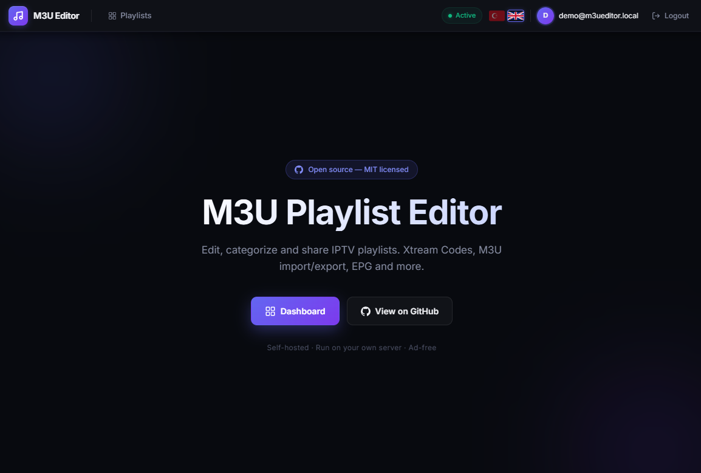
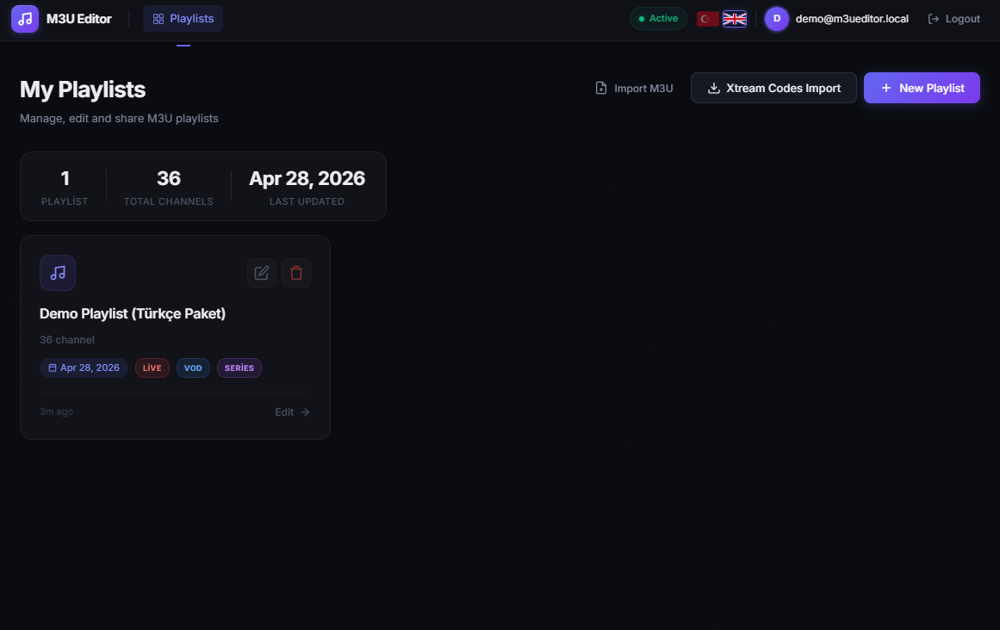
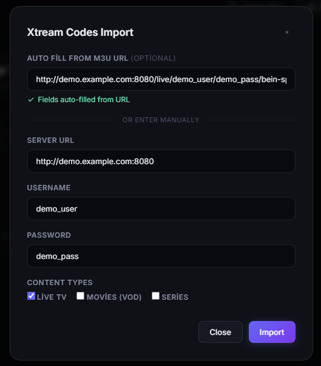
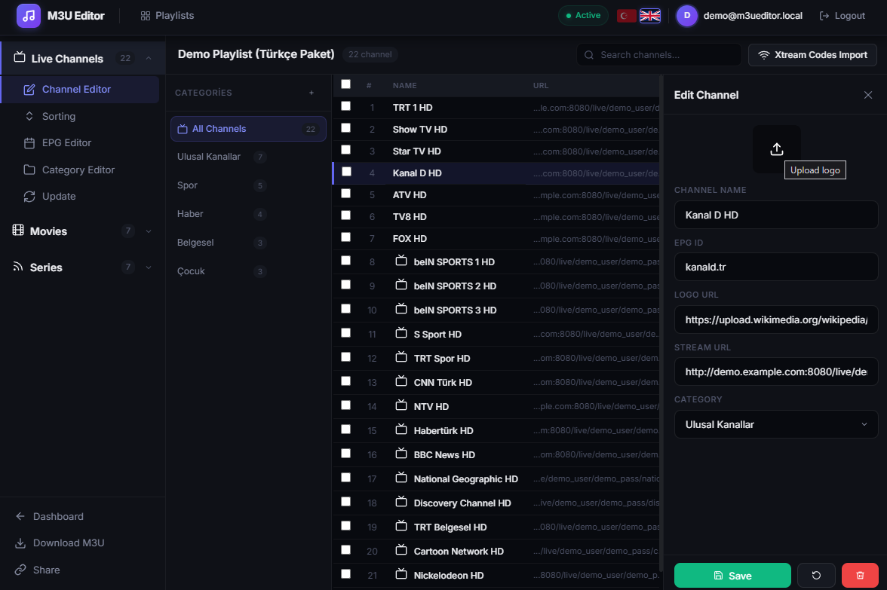
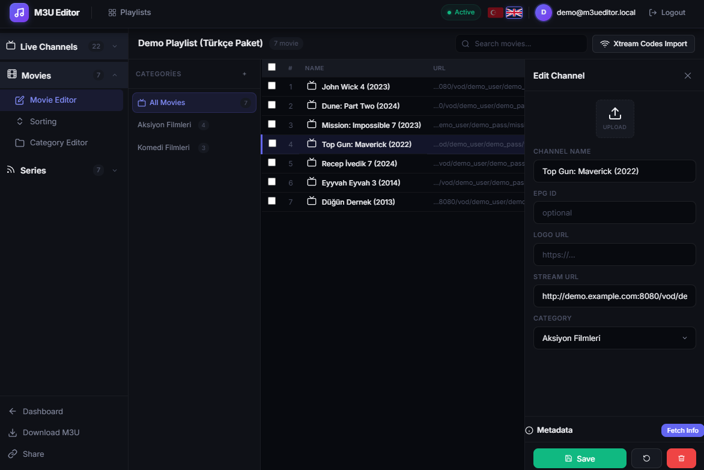
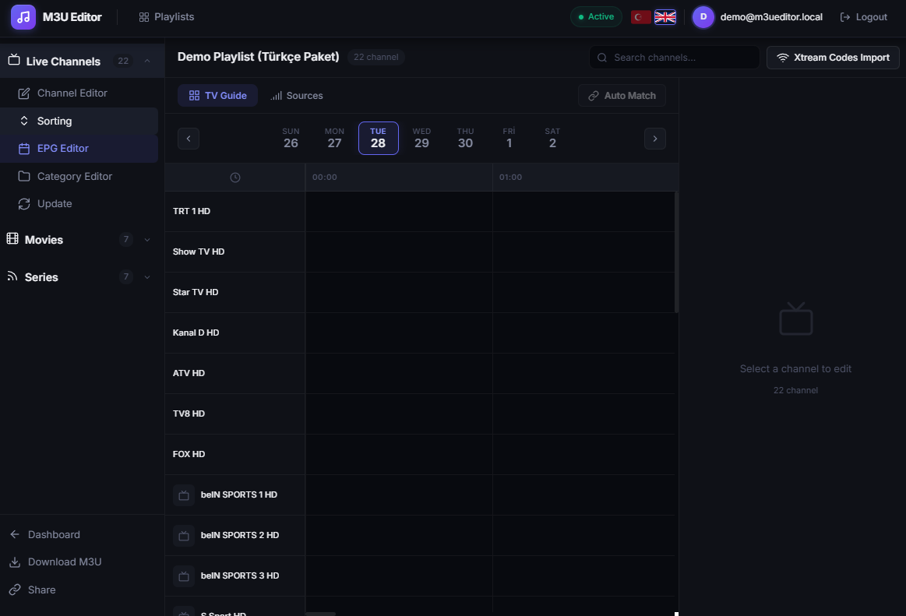
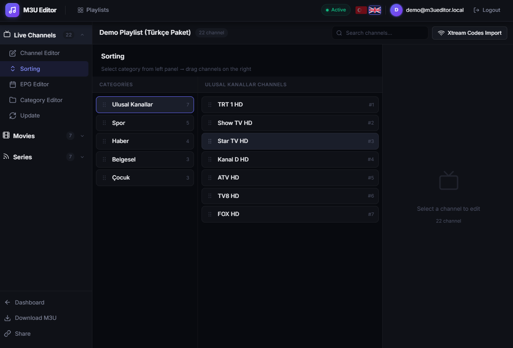
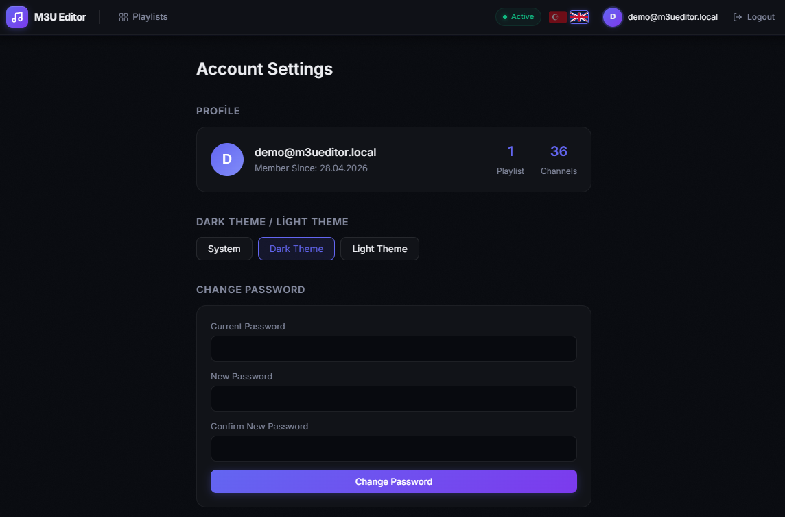

# M3U Playlist Editor

> A modern, self-hosted IPTV playlist manager. Edit, categorize and share your M3U playlists with native Xtream Codes integration, EPG support, drag-and-drop sorting and a clean dark/light UI.

[](LICENSE)
[](https://nodejs.org/)
[](https://vuejs.org/)
[](https://www.postgresql.org/)



---

## ✨ Features

- **Xtream Codes API integration** — Connect with server URL, username and password. Automatically pulls Live TV, Movies (VOD) and Series with categories.
- **M3U import / export** — Import from a local file or remote URL, edit, then export back to a clean `.m3u` file.
- **EPG TV Guide** — Add XMLTV sources, automatic channel-to-EPG matching, multi-day programme grid.
- **Bulk channel editing** — Rename channels, change logos, edit stream URLs, swap categories — all from a side panel.
- **Drag-and-drop sorting** — Reorder both categories and channels with smooth drag handles.
- **Three content types** — Separate editors for Live Channels, Movies (VOD) and Series with their own categories and counts.
- **Search & filter** — Trigram fuzzy search across thousands of channels (PostgreSQL `pg_trgm`).
- **Multi-language UI** — Turkish + English (i18n keys, easy to extend).
- **Dark / Light / System theme** — Per-user preference saved in browser.
- **Authentication** — JWT access tokens + refresh tokens, password reset flow with SMTP, account deletion.
- **Self-hosted & free** — No accounts on third-party servers, no plan limits, no ads. MIT licensed.

---

## 📸 Screenshots

### Landing page
Clean entry page with theme-aware hero, language switcher and direct GitHub link.


### My Playlists
Dashboard showing all playlists with channel counts, stream-type badges (LIVE / VOD / SERIES), creation dates and quick actions for editing or deleting.



### Xtream Codes import
One-step connect flow. Auto-fills server URL, username and password by parsing a regular `get.php?...` M3U URL, or fill the fields manually. Pick which content types to pull.



### Channel Editor (Live)
Three-pane editor: stream-type sidebar, category list, channels table, and an edit panel for the selected channel (logo upload, EPG ID, stream URL, category).



### Movie Editor (VOD)
The same editor specialized for movies — separate categories, channel-count badges per category, and a metadata "Fetch Info" action that hydrates titles from external sources.



### EPG Editor
Multi-day TV-guide grid. Add XMLTV sources, auto-match channels by `tvg-id`, then visually inspect the programme schedule per channel.



### Drag-and-drop sorting
Reorder categories on the left, then drag channels on the right. Order is persisted instantly.



### Account settings
Profile summary, theme switcher (System / Dark / Light) and password change.



---

## 🧱 Tech stack

**Backend**
- Node.js 18+ · Express 4
- PostgreSQL 13+ · Knex 3 (migrations + query builder)
- JWT (access + refresh) · bcryptjs · helmet · express-rate-limit
- Pino structured logging · Nodemailer (SMTP)

**Frontend**
- Vue 3 (Composition API) · Vue Router 4 · Pinia 3
- Vite 6 · Axios
- Vanilla CSS with design tokens (no Tailwind)

**Architecture**
- Layered: routes → controllers → services → models
- M3U / EPG parsers as standalone modules (`src/parsers/`)
- Xtream Codes client with retry + exponential backoff (`src/services/XtreamClient.js`)

---

## 🚀 Quick start

### Prerequisites
- Node.js **18+**
- PostgreSQL **13+** (with `pg_trgm` extension — auto-enabled by the first migration)

### 1. Clone & install
```bash
git clone https://github.com/fyildirim-debug/M3uEditor.git
cd M3uEditor

# Backend deps
npm install

# Frontend deps
cd frontend && npm install && cd ..
```

### 2. Configure environment
Copy the example file and fill in your values:

```bash
cp .env.example .env
```

Minimum required keys:
```env
PORT=3000
DB_HOST=localhost
DB_PORT=5432
DB_NAME=m3u_playlist_editor
DB_USER=postgres
DB_PASSWORD=postgres
JWT_SECRET=change-me-to-a-long-random-string
APP_URL=http://localhost:5173
CORS_ORIGIN=http://localhost:5173
```

SMTP keys (`SMTP_HOST`, `SMTP_USER`, `SMTP_PASS`, …) are optional — only needed for password-reset emails.

### 3. Create the database
```bash
createdb m3u_playlist_editor      # or use psql / pgAdmin
npm run migrate
```

### 4. (Optional) Seed demo data
A one-shot seed creates a demo user with one populated playlist (9 categories, 36 channels — Live + VOD + Series) so you can explore the UI immediately:

```bash
npm run seed:demo
```

Demo login:
```
Email:    demo@m3ueditor.local
Password: demo1234
```

### 5. Run

```bash
# Terminal 1 — backend (http://localhost:3000)
npm run dev

# Terminal 2 — frontend (http://localhost:5173)
cd frontend && npm run dev
```

Open http://localhost:5173 and sign in.

---

## 🐳 Docker

A `docker-compose.yml` is included for a single-command boot:

```bash
docker compose up -d
```

This starts the API, the static frontend (served by Nginx) and a PostgreSQL container with persistent volume.

---

## 📁 Project layout

```
.
├── src/                    Backend
│   ├── config/             DB, JWT, env config
│   ├── controllers/        Route handlers
│   ├── routes/             Express routers
│   ├── services/           Business logic (Auth, Channel, EPG, Xtream, …)
│   ├── parsers/            M3UParser, M3UFormatter, EPGParser
│   ├── middleware/         auth, admin, errorHandler
│   ├── models/migrations/  Knex SQL migrations
│   └── utils/              AppError, helpers
│
├── frontend/               Vue 3 SPA
│   └── src/
│       ├── views/          Landing, Login, Dashboard, Editor, Account, Admin, …
│       ├── stores/         Pinia (auth)
│       ├── langs/          i18n (tr.json, en.json) + useI18n composable
│       ├── composables/    useTheme
│       └── api.js          Axios instance with refresh-token interceptor
│
├── scripts/                One-shot scripts (seed-demo.js, …)
├── tests/                  Jest unit + property tests
├── screenshot/             UI screenshots used in this README
├── knexfile.js             Knex config
└── docker-compose.yml      Local stack
```

---

## 🔐 Security notes

- Passwords are hashed with **bcryptjs** (cost factor 10).
- JWT secret **must** be rotated on first deploy — do not ship the example value.
- Auth endpoints are rate-limited (20 req / 15 min).
- All routes use **helmet** for security headers and **CORS** is locked to `CORS_ORIGIN`.
- Stream URLs and channel data live in your own PostgreSQL — nothing is sent to third parties.

---

## 🤝 Contributing

PRs and issues are welcome. Before opening a PR:

```bash
npm test          # Jest unit tests
npm run migrate   # ensure migrations are clean
```

Conventional commits are used (`feat:`, `fix:`, `refactor:`, `docs:`, …).

---

## 📜 License

MIT © Furkan Yıldırım — see [LICENSE](LICENSE).

---

## 🙏 Credits

Built with [Vue 3](https://vuejs.org/), [Express](https://expressjs.com/), [Knex](https://knexjs.org/) and [PostgreSQL](https://www.postgresql.org/).
Channel logos used in the demo seed are sourced from Wikimedia Commons.
