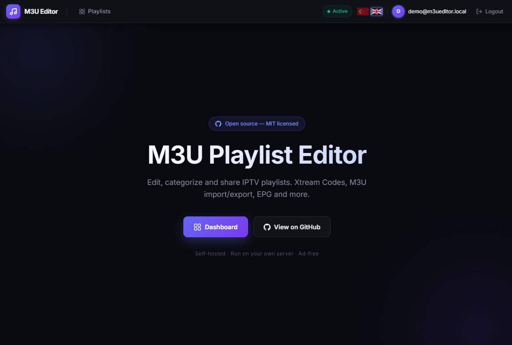
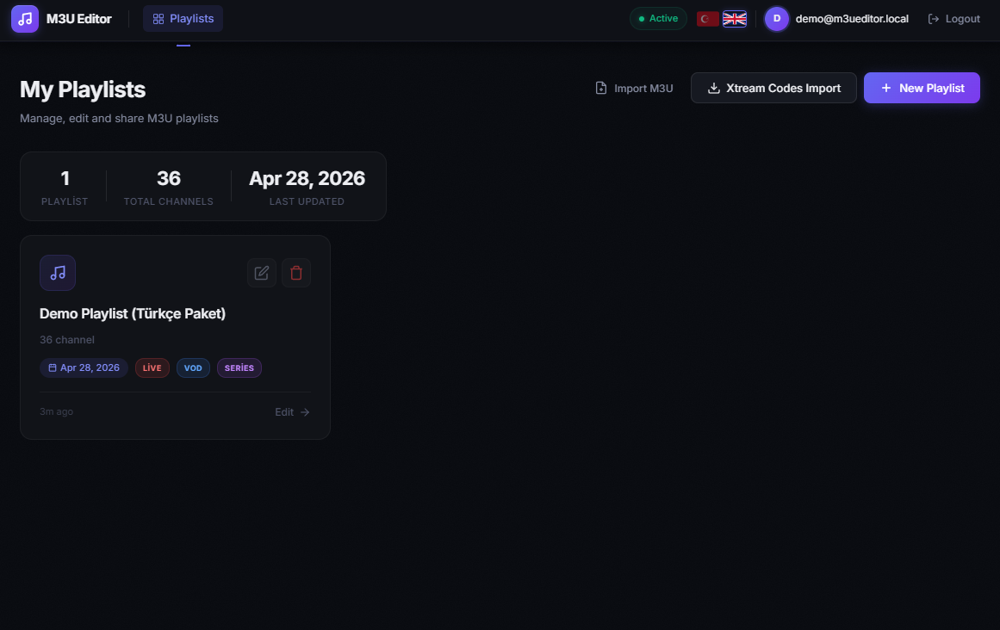
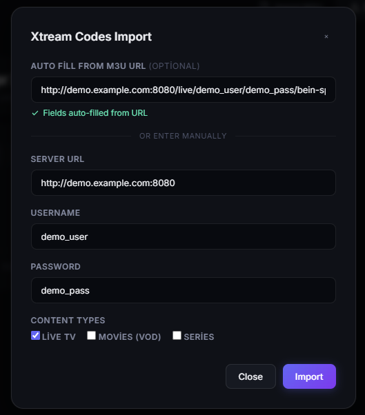
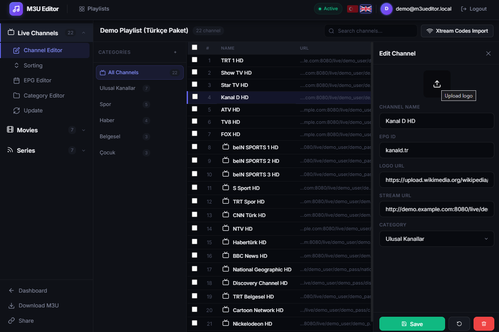
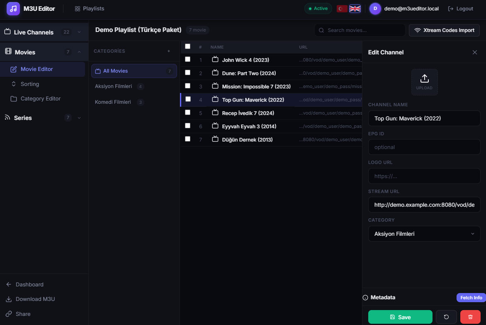
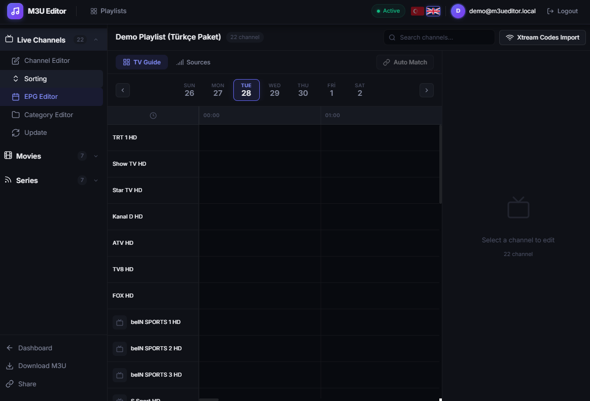
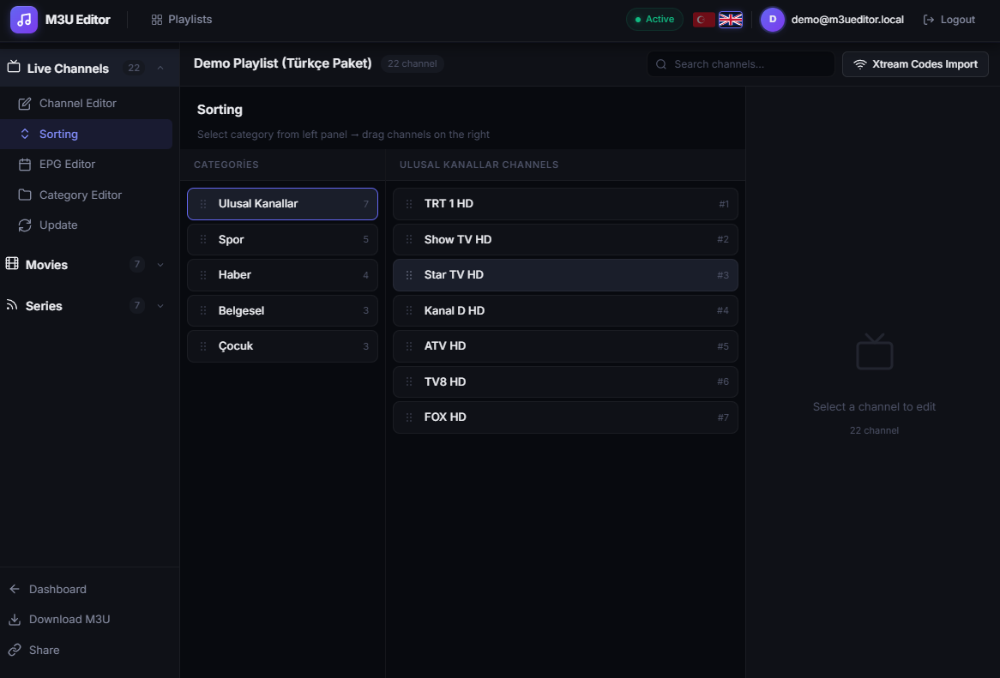
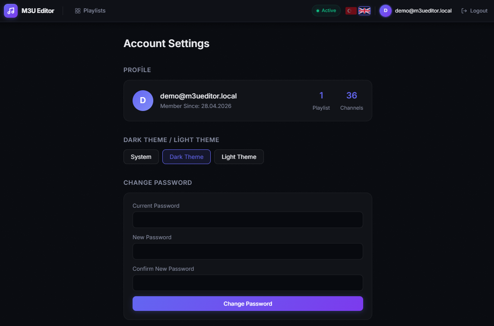

# M3U Playlist Editor

A self-hosted IPTV playlist manager for importing, editing, organizing, exporting, and sharing M3U/Xtream playlists. It includes a responsive Vue interface, XMLTV guide support, multi-user isolation, and a production Docker stack.

[](LICENSE)
[](https://nodejs.org/)
[](https://vuejs.org/)
[](https://www.postgresql.org/)
[](#)



## Release notes

Every release is documented in [CHANGELOG.md](CHANGELOG.md), including the audit
finding each change closes.

## Highlights

- AI assistant that drives the whole application through chat with your own OpenAI-compatible provider
- Xtream Codes imports for Live TV, VOD, and Series
- Local or remote M3U import and escaped M3U export
- XMLTV sources, source-scoped channel matching, and timezone-aware guide views
- Category and channel sorting, bulk operations, logo uploads, search, and metadata
- Short-lived access tokens with rotating HttpOnly refresh sessions
- Turkish and English interface, light/dark/system themes, keyboard navigation, and mobile layouts
- PostgreSQL migrations, structured logs, health checks, CI, and hardened containers

## Screenshots

### Landing page
Clean entry page with theme-aware hero, language switcher and direct GitHub link.


### My Playlists
Dashboard showing all playlists with channel counts, stream-type badges (LIVE / VOD / SERIES), creation dates and quick actions for editing or deleting.



### Xtream Codes import
One-step connect flow. Auto-fills server URL, username and password by parsing a regular `get.php?...` M3U URL, or fill the fields manually. Pick which content types to pull.



### Channel Editor (Live)
Three-pane editor: stream-type sidebar, category list, channels table, and an edit panel for the selected channel (logo upload, EPG ID, stream URL, category).



### Movie Editor (VOD)
The same editor specialized for movies — separate categories, channel-count badges per category, and a metadata "Fetch Info" action that hydrates titles from external sources.



### EPG Editor
Multi-day TV-guide grid. Add XMLTV sources, auto-match channels by `tvg-id`, then visually inspect the programme schedule per channel.



### Drag-and-drop sorting
Reorder categories on the left, then drag channels on the right. Order is persisted instantly.



### Account settings
Profile summary, theme switcher (System / Dark / Light) and password change.



## Requirements

- Node.js 22 or newer
- PostgreSQL 13 or newer (PostgreSQL 16 is used by Docker and CI)
- npm 10 or newer

## Local development

```bash
git clone https://github.com/fyildirim-debug/M3uEditor.git
cd M3uEditor
npm ci
cd frontend
npm ci
cd ..
```

Copy `.env.example` to `.env`, then set the database and application values.
`JWT_SECRET` and `CREDENTIAL_ENCRYPTION_KEY` must be two independently generated
values of at least 32 characters. Production startup rejects the shipped
placeholders, short values, low-entropy values, and reusing one value for both:

```bash
echo "JWT_SECRET=$(openssl rand -hex 32)"
echo "CREDENTIAL_ENCRYPTION_KEY=$(openssl rand -hex 32)"
```

Create the database and start the application:

```bash
npm run migrate
npm run dev
```

In a second terminal:

```bash
cd frontend
npm run dev
```

The frontend defaults to `http://localhost:5173`; the API and health endpoint default to `http://localhost:3000` and `http://localhost:3000/health`.

## Creating the first admin

First create a regular user account in the application, then grant admin rights to that registered email address:

```bash
npm run make-admin -- <email>
```

On a Docker setup, run the same command inside the API container:

```bash
docker compose exec api npm run make-admin -- <email>
```

Append `--revoke` to the command to remove the privilege.

## Registration and password recovery

Set `ALLOW_REGISTRATION=false` to stop new accounts from being created. The default is `true` for backward compatibility. So a fresh install never locks itself out, the first user can register even when the flag is off while the `users` table is empty; registrations after the first user are rejected. The unauthenticated `GET /api/auth/registration-status` endpoint returns only the current state as `{ "allowed": boolean }`.

When SMTP is not configured, reset a registered user's password to a strong, randomly generated value:

```bash
npm run reset-password -- <email>
```

Append `--password <value>` to set a specific password. All of the user's active sessions are revoked when the password is reset. On a Docker setup, run the command inside the API container:

```bash
docker compose exec api npm run reset-password -- <email>
```

## Docker deployment

Create `.env` from `.env.example`. Generate the two secrets independently — do not reuse one value for both, and do not ship the placeholders:

```bash
echo "JWT_SECRET=$(openssl rand -hex 32)"
echo "CREDENTIAL_ENCRYPTION_KEY=$(openssl rand -hex 32)"
```

```env
DB_PASSWORD=a-strong-database-password
JWT_SECRET=<output of the first command>
CREDENTIAL_ENCRYPTION_KEY=<output of the second command>
APP_URL=https://m3u.example.com
CORS_ORIGIN=https://m3u.example.com
HTTP_PORT=8080
```

Then run:

```bash
docker compose up -d --build
docker compose ps
```

### TLS is required and is not included

**The Compose stack serves plain HTTP only. It has no TLS listener, certificate, or HTTP-to-HTTPS redirect.** Exposing that port directly to a network you do not control lets anyone on the path read login credentials, bearer tokens, and provider stream URLs, or modify responses. Refresh cookies are marked `Secure` in production, so sessions will not survive a direct HTTP deployment either.

Terminate TLS in front of the stack and keep the container port private:

- Bind the published port to loopback (`HTTP_PORT=8080` and a `127.0.0.1:8080:80` mapping), or attach the frontend to an internal Docker network reachable only by your proxy.
- Put Caddy, Traefik, nginx, or a cloud load balancer in front, terminating HTTPS on 443 and redirecting 80 to 443.
- Forward `X-Forwarded-For` and `X-Forwarded-Proto` from that proxy, and keep `TRUST_PROXY` set to the number of proxies in front of the API — rate limiting keys on the client IP derived from those headers.
- Enable HSTS at the proxy only after HTTPS is verified end to end.

A LAN-only deployment behind a firewall is the one case where plain HTTP is defensible, and even then any client on that LAN can read the traffic.

The API container applies pending migrations before startup. PostgreSQL is not exposed to the host. Uploaded logos and database files use named volumes. The API runs as a non-root user with a read-only root filesystem; the frontend is served by Nginx with security and cache headers.

Private-network remote URLs are blocked by default to prevent SSRF. Only set `ALLOW_PRIVATE_NETWORK_URLS=true` when importing from a trusted service on your own network and after understanding the exposure.

### Large Xtream providers

Xtream imports use one bulk stream request per selected content type and download two content types concurrently. If a provider omits categories from a bulk response, only the missing categories are fetched with bounded concurrency. Channel writes use 1,000-row PostgreSQL batches.

The Docker defaults are sized for playlists with roughly 150,000 Live/VOD/Series entries:

```env
MAX_XTREAM_BYTES=268435456
XTREAM_CATEGORY_CONCURRENCY=8
XTREAM_TYPE_CONCURRENCY=2
NODE_MAX_OLD_SPACE_MB=1536
```

Lower the concurrency values if a provider rate-limits parallel requests. Increase `MAX_XTREAM_BYTES` and `NODE_MAX_OLD_SPACE_MB` together only when a single provider response exceeds the defaults and the host has sufficient memory.

## Xtream Codes output

A playlist can be exposed as an Xtream Codes output via `POST /api/playlists/:id/xtream-output` on the authenticated management API. The response contains the server address, a random username, and a random password to enter into the player. The password is stored AES-256-GCM encrypted and is always shown in plain text to its owner; the configuration — including the password — is returned by every `GET`. `POST /api/playlists/:id/xtream-output/regenerate` immediately invalidates the old password, and `DELETE /api/playlists/:id/xtream-output` turns player access off.

In TiviMate, IPTV Smarters, and similar clients, use `APP_URL` as the server address and the username and password from the activation response. Supported root paths are `/player_api.php`, `/xmltv.php` and `/get.php` — the catalogue only. Because series data is stored per series rather than per episode, the Xtream response exposes one playable synthetic season/episode per series.

**This server is never the stream address.** `get.php` publishes the provider's own channel URLs and `player_api.php` fills `direct_source` with them, so the player pulls every stream straight from the source and no playback request touches this application. There are no `/live/`, `/movie/` or `/series/` paths and no setting that turns them on: the earlier `proxy` mode, which handed out a local address and answered it with a `302` to the provider, has been removed along with its `playlists.output_stream_mode` column. A player that ignores `direct_source` and builds stream URLs from the server address instead will not play — use a client that honours `direct_source` (TiviMate, IPTV Smarters and the common Android/iOS players do).

**Security note:** The published channel URLs are the upstream provider's own addresses, which by Xtream protocol design may contain the provider's username and password. Sharing Xtream output credentials therefore effectively shares the provider account and every stream URL in the edited playlist. Share only with people you trust, and revoke access by disabling the output or regenerating the password.

## Logo library

Channel logos rarely arrive complete from a provider. The editor's channel panel
carries a **Find logo** button that opens a searchable browser over
[tv-logo/tv-logos](https://github.com/tv-logo/tv-logos) — 10.700+ ready-made
channel logos across 48 countries and 16 other groups (VOD, sports, flags,
regional bundles).

Type a channel name and the grid filters as you type; the country selector next
to the box narrows the search to one country, and country names are shown in the
interface language. Clicking a logo writes it to the channel immediately.

The file index is pulled from GitHub's tree endpoint **once a day** and kept in
memory, so searching never calls out; a failed refresh keeps serving the previous
index rather than breaking the feature. Anonymous GitHub allows 60 requests an
hour, which one daily fetch never approaches — set `GITHUB_TOKEN` only if you
share an IP with something else that hits the API. Images are served from
jsDelivr (`TV_LOGOS_CDN_BASE`), not from raw.githubusercontent, because the grid
loads hundreds of thumbnails at once; the URL stored on the channel is that same
CDN address, exactly like the external logo URLs that arrive with an import.

Matching is tolerant of how channels are actually named: quality and country tags
(`FHD`, `4K`, `TR:`) are stripped, Turkish characters are folded, and scoring
prefers exact names over prefixes over partial word matches — `TRT 1 FHD` finds
`trt-1-tr.png`, `TR: NTV FHD` finds `ntv-tr.png`. The assistant can do the same
through `search_logo_library`, `set_channel_logo_from_library` and
`apply_library_logos`, the last of which fills in every channel that has no logo
and reports the ones it was not confident about instead of guessing.

## AI assistant

Every authenticated page carries a chat launcher in the bottom-right corner, and
the same settings live under **Account → AI Assistant**. The assistant is not a
help bot: it operates the application through **175 server-side tools**, so it can
do anything the UI can do — and a good deal the UI cannot. It also accepts file
attachments, streams its answer as it is produced, can pause for your approval
before destructive work, hands finished output back as downloadable files, and
can be given recurring jobs that run on the server without a browser.

### Bring your own provider

Nothing is hard-coded to a vendor. In the assistant's settings panel you enter:

- **Base URL** — any OpenAI-compatible endpoint (`https://api.openai.com/v1`,
  OpenRouter, Groq, Together, vLLM, LM Studio, Ollama's `/v1`, …).
- **API key** — stored AES-256-GCM encrypted with `CREDENTIAL_ENCRYPTION_KEY`,
  never returned to the browser afterwards (the API only reports whether a key
  exists).
- **Model** — press *Fetch models* to call the provider's `GET /models` and pick
  one from the list; providers without that endpoint accept a typed model id.

Temperature, the maximum number of tool steps per turn (1–25), an optional extra
system instruction, and a **destructive-actions** switch are configured in the
same panel. Requests to the provider go through the same SSRF-safe HTTP client
as every other outbound call, so a base URL pointing at a private address is
rejected unless `ALLOW_PRIVATE_NETWORK_URLS=true` — which is what a local Ollama
or LM Studio endpoint needs.

### What it can do

- **Playlists** — create, rename, duplicate, delete, clear, stats, channel
  counts, compare two playlists, move or copy channels and categories between
  playlists, store Xtream credentials, schedule auto-sync, backups
  (create/list/restore/delete/download).
- **Categories** — create in bulk, rename, bulk find-and-replace on names,
  prefix/suffix, normalise, hide/show, delete (with or without their channels),
  drop empty ones, merge, deduplicate, split by pattern, auto-categorise by
  keyword rules, sort by name/count/creation/explicit order, move to a position,
  per-category stats.
- **Channels** — search (exact and fuzzy), create one or many at once, edit,
  bulk-update, move between categories, find-and-replace rename with dry run,
  prefix/suffix/strip, case conversion, strip quality tags, rewrite stream URLs,
  change stream type, clear logos, reset to provider values, delete by filter,
  deduplicate, sort A–Z / by category / naturally / EPG-first / explicit order,
  sort inside every category, move to position or to the top, swap, per-channel
  and full-playlist health scans, dead-channel reports.
- **EPG** — add/refresh/delete XMLTV sources, add straight from the iptv-org
  library, refresh-interval scheduling, auto-match, per-channel matching,
  match suggestions, bulk tvg-id assignment, clear matches, copy matches between
  playlists, coverage reports, guide listings, now-playing, and **pulling channel
  logos out of the guide**.
- **Import & sync** — M3U by URL or pasted content, Xtream with preview and
  category selection, credential testing, sync one or all playlists, add stream
  types, provider sources, filter rules (create/update/test/move/delete).
- **Export & sharing** — M3U preview, export URLs, JSON export, share links with
  expiry and password, Xtream output enable/regenerate/disable, XMLTV coverage,
  view profiles.
- **Attachments & output files** — list, describe, page through and search an
  attached file, import an attached M3U straight into a playlist, write a report
  or converted list to a downloadable file, export a playlist to an M3U file.
- **Scheduled tasks** — create, list, update, delete and run recurring jobs.
- **Account** — own account summary, usage overview, storage report, recent
  activity, system status.

### Attaching files

The paperclip in the composer accepts `.m3u`, `.m3u8`, `.txt`, `.xml`, `.xmltv`,
`.json` and `.csv` up to 20 MB each (`AI_ATTACHMENT_MAX_BYTES`), with a 200 MB
per-account ceiling (`AI_ATTACHMENT_QUOTA_BYTES`). The format is detected from
the content, not the extension. The file is stored on disk under
`AI_ATTACHMENT_DIR` (by default a sibling of the logo directory, so it lives in
the same volume) while only metadata, a short preview and a content summary —
entry count for M3U, channel/programme counts for XMLTV, columns for CSV — go
into the database.

**The file is never handed to the model in one piece.** The message carries the
attachment id and its summary; from there the assistant pages through it with
`read_attachment` (line windows), narrows it with `search_attachment`, or imports
it wholesale with `import_attachment`. A 20 MB playlist is therefore workable
without ever filling the context window. XMLTV attachments can be read and
searched but not imported — EPG ingestion streams from a URL, so add those as an
EPG source instead.

Anything the assistant produces — a CSV report, a converted list, a filtered M3U
— comes back as a download card in the chat, served from
`GET /api/ai/attachments/:id/download` with the owner's session required.

There is **no practical message length limit**. Text beyond
`AI_INLINE_MESSAGE_CHARS` (12.000) is stored as an attachment automatically and
the model receives a preview plus the id, so pasting a whole playlist into the
box works the same way as attaching it. The hard ceiling is
`AI_MAX_MESSAGE_CHARS` (1.000.000).

### Live streaming, approvals and scheduled tasks

`POST /api/ai/chat/stream` returns Server-Sent Events: text arrives token by
token and every tool step appears the moment it starts, so a long chain is
visible while it runs instead of after it finishes. Gateways that do not support
streaming are detected on the first response and the panel falls back to the
plain `POST /api/ai/chat` endpoint with no visible difference beyond the text
landing at once.

With **Ask for my approval before destructive actions** enabled, a `[YIKICI]`
call does not run: it stops in the chat as a confirmation card carrying the tool
name and an impact estimate, and the rest of that turn's calls wait in a queue so
the provider never sees a half-finished turn. Approving runs exactly the stored
call; declining closes it and the queued calls with a "not approved" result, and
the assistant is told so it can react.

Recurring work — *"check this Xtream source every morning and add new channels
to the right categories with matching EPG"* — becomes a scheduled task simply by
saying it: the assistant turns the sentence into a task, binds it to the playlist
you are working on, and tells you what it set up. Tasks live in `ai_tasks`, run on
the server via `SchedulerService` (minimum interval 15 minutes,
`AI_MIN_TASK_INTERVAL_MINUTES`), and each run starts a fresh conversation so
context does not accumulate. Destructive permission is **per task and off by
default**; a task cannot ask for approval, so an unattended run that hits one
stops and records why.

**Every run is logged and can be undone with one click.** A task bound to a
playlist takes a backup *before* it runs, then writes a row in `ai_task_runs`
holding the status, the assistant's summary, the tools it executed, and how the
channel and category counts changed. The assistant's task tab shows this history
per task; each entry carries an **Undo** button that restores that pre-run backup.

Two things worth knowing about undo. It restores the playlist to the moment
before the run, so changes *you* made after the run are lost too — the
confirmation says so, and the action is one-way. And it depends on the backup
still existing: task backups are kept in their own retention bucket (the last 10,
counted separately from your manual backups so nightly runs cannot push yours
out), and a run whose backup has aged out shows as not undoable rather than
failing when you press the button. A task with no playlist bound cannot be backed
up at all and is marked accordingly from the start.

`list_task_runs` and `undo_task_run` expose the same thing to the assistant, so
*"what did last night's task do?"* and *"undo it"* work in chat as well.

Providers cap how many functions one request may carry (OpenAI's limit is 128),
so each turn ships the first 120 tools plus three meta-tools —
`search_capabilities`, `describe_capability` and `invoke_capability`. The
assistant searches the catalogue for anything not in its current list and invokes
it by name, so no capability is ever out of reach.

`GET /api/ai/capabilities` returns the whole catalogue with descriptions; the
settings panel renders it too. Assistant replies are rendered as Markdown —
**bold**, *italic*, `code`, lists, headings and links — with the text escaped
before any formatting is applied, so nothing the model emits can inject HTML.

### Safety rails

- **The assistant's authority equals its own user's — never more.** Every tool
  runs as the authenticated user through the normal service layer, so tenant
  ownership, validation, and business rules are identical to the UI's. The
  identity comes from the session alone: `userId`, `is_admin` and similar keys
  are stripped from model-supplied arguments before a tool sees them, and a tool
  call without a session is refused. No admin endpoint is in the catalogue, so
  even an administrator's assistant is confined to that administrator's own
  playlists, channels and sources.
- Tools that lose data are labelled `[YIKICI]` for the model, marked in the chat
  trace, and gated behind the destructive-actions switch. Turning it off makes
  deletion, restore, overwrite, and share-revocation tools fail with a message
  telling the model to ask you first.
- Selections are bounded (at most 5000 channels per bulk call) and tool output is
  truncated before it goes back to the model.
- Every executed tool is shown in the chat as a trace line, so a turn's real
  effects are visible rather than inferred from prose.
- Conversations are stored per user in `ai_conversations`/`ai_messages` and can
  be deleted; `POST /api/ai/chat` is rate-limited per user. The panel remembers
  the open conversation across reloads and lists past ones in its history tab —
  only the conversation id lives in the browser, the content stays on the server.
- Attachments are stored under a generated id, never under the supplied filename,
  so a crafted name cannot escape the user's own directory. Every read, download
  and delete goes through an ownership check, and deleting a conversation removes
  its files from disk as well as its rows.
- File contents are third-party data. The system prompt states this explicitly
  and the attachment manifest repeats it per message, so instructions embedded in
  a playlist or guide are treated as text, not as commands.
- Scheduled tasks run with their owner's authority and their own destructive
  switch; they cannot create or trigger other tasks, which rules out runaway
  loops.

Endpoints: `GET/PUT /api/ai/settings`, `POST /api/ai/models`,
`GET /api/ai/capabilities`, `POST /api/ai/chat`,
`GET/DELETE /api/ai/conversations[/:id]`.

## Verification

```bash
npm run check
npm run test:ci
npm audit --audit-level=high

cd frontend
npm run check
npm audit --audit-level=high
```

CI additionally starts PostgreSQL, applies every migration, verifies the Compose configuration, and builds the production frontend.

## Security model

- Passwords use bcrypt with cost factor 12.
- Access tokens expire after 15 minutes by default and are rejected unless they carry a valid issuer, audience, expiry, and session id; every request revalidates the session against the database, so logout and password changes take effect immediately.
- Refresh tokens are random, hashed at rest, rotated on use, and delivered in `HttpOnly`, `SameSite=Strict` cookies. Replaying an already-rotated token revokes the entire session family, so a stolen token cannot outlive its detection.
- Login, registration, password reset, session refresh, and password-protected share downloads each have their own rate limit; the share limiter is keyed per token so one link cannot exhaust another's budget.
- Writable channel fields are length- and type-checked, and control characters are rejected so exported M3U output cannot be injected with extra lines.
- Saved Xtream passwords and EPG source URLs use AES-256-GCM authenticated encryption. Note that Xtream stream URLs embed the provider username and password by protocol design, so every imported channel row — and every exported or shared M3U — still contains those credentials in clear text. Encrypting the credential column does not protect them from someone who can read the database, a backup, or a shared playlist.
- Share and password-reset tokens are stored as hashes; protected shares use bcrypt passwords.
- Remote M3U, XMLTV, metadata, and stream checks resolve DNS before connection, reject private/reserved addresses, revalidate redirects, enforce timeouts, and cap response sizes.
- Tenant ownership is checked before playlist, category, channel, EPG, upload, export, and admin mutations.
- Uploaded logos are size-limited and validated by image signatures; SVG uploads are not accepted. The cacheable `/logos` route is intentionally unauthenticated, but local logo files are removed when their channel, playlist, or account is deleted, and when a local logo is replaced by an external URL. Run `node scripts/cleanup-logos.js` for a dry-run orphan report or add `--delete` to remove reported orphan files.
- Production startup refuses to boot on missing, short, placeholder, low-entropy, or identical secrets.
- Transport security is **not** provided by this stack; see [TLS is required and is not included](#tls-is-required-and-is-not-included).

Do not commit `.env`, database dumps, exported playlists, or provider credentials. Rotate both application secrets when an environment may have been exposed; existing encrypted credentials must be re-entered after rotating `CREDENTIAL_ENCRYPTION_KEY`.

## Project layout

```text
src/
  config/             Environment, database, JWT, and logger
  controllers/        HTTP request handlers
  middleware/         Authentication, admin, and errors
  models/migrations/  PostgreSQL schema migrations
  parsers/            M3U and XMLTV parsing/formatting
  routes/             Express routers
  services/           Authentication, import, EPG, and domain logic
  utils/              Encryption, SSRF-safe fetch, and validation
frontend/src/         Vue application
screenshot/           UI screenshots used in this README
tests/                Jest unit and property tests
```

## Latest updates

### v1.10.0.0 — 2026-08-02

- **AI assistant with full application access.** A chat panel on every
  authenticated page drives 55 server-side tools covering playlists, categories,
  channels, EPG, imports, exports, filter rules, health scans, backups, and
  views — including playlist merging and pulling logos out of the EPG guide.
  Bring your own OpenAI-compatible provider: base URL and API key are yours, the
  model list is fetched from the provider, and the key is stored encrypted.
  Destructive tools are gated behind a switch and every executed tool is shown
  in the chat trace. See [AI assistant](#ai-assistant).

### v1.8.0.0 — 2026-08-01

- **Category-selective sync with a report.** Updating a playlist now asks which
  categories to pull — previous selections come pre-checked, provider-new
  categories are badged "New", and unselected categories are never added (a
  long-standing bug imported them anyway). A report lists added categories,
  new channel names, and updated/removed counts. Per-type selection is
  optional; untouched types are preserved.
- **Xtream output password always visible.** The output password is stored
  AES-256-GCM encrypted (new migration) and shown to its owner on every view,
  with one-click regeneration that instantly invalidates the old password.
  M3U download and Xtream credentials now live in a single "Download Channel
  List" modal.
- **EPG scales to 55k+ channels.** The guide loads channels in pages with
  infinite scroll instead of freezing the browser, program descriptions are
  fetched lazily only when a program is opened, and grid hour lines moved from
  24 DOM nodes per channel to one CSS background.
- **Modal and rendering fixes.** Child component updates suppressed by a toast
  in the same render flush (modals stuck open), playlist deletion of 55k
  channels down from ~13 s to ~0.06 s with spinner feedback, EPG controls
  removed from movie/series editing, and the Xtream import wizard gained a
  Cancel button, a 150 s timeout, and backdrop-click protection.

See [CHANGELOG.md](CHANGELOG.md) for the full history.

## License

MIT © Furkan Yıldırım. See [LICENSE](LICENSE).
